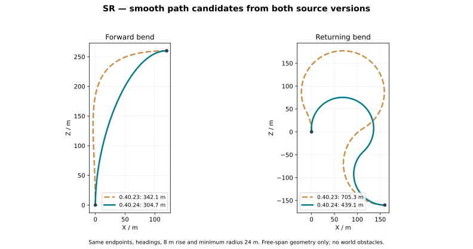

# SR 0.40.24-alpha：第三轮 11 图反馈

生产源码：`65e1db5cb96ab7fa6a3df8e3eee6a0538fb840df`（GitHub），本地同树 `4faa2b6`。分支：`chat/sr-04021-ramp-matrix`。

本轮依据新上传的 01–11 图修改；没有使用残留的旧 12、13 图。以下是源码处理和验证范围，不等同于用户原存档的画面验收。

| 反馈 | 本次处理 | 验证与边界 |
|---|---|---|
| 图一：斜坡柱顶缝隙 | 取消“整根柱顶压到坡面最低处”；柱顶四角跟随局部纵坡，柱底埋入基础；碰撞栅格同步使用斜面棱柱。保留 1.5m 同款单柱。 | 覆盖四个朝向、坡度 -20%～25%，四角贴合且不侵入自有路面。 |
| 图二：外扩渐变挡住入口 | 新增外侧车道的上游渐变由匝道提供路面，主路不再同时铺一段挡路的车道；此段不生成封闭绿化。切换 ADD→EXTRA 时清除旧加道和旧封闭数据。 | 实际规划器检查切换、旧渐变清理；对普通/高速、左右行驶、双向组合复核。图片所用的确切模式与原存档仍需画面复查。 |
| 图三：同路其他匝道改变 | 派生的开口、封闭、加道、高架分类不再被当作主路线形编辑；邻近独立匝道保留原设施，候选路线须避让其已有构件，不能靠改造旧匝道腾空间。 | 新增汇入点相隔 130m、使用相邻车道的连续建造/删除测试；另保留原远距离测试。 |
| 图四：孤立短栏杆、横向突头 | 仅过滤非端点处不足 0.75m 的自动外侧护栏碎段；封闭端帽按重叠区并集生成，横向护栏内移到完整路面一侧，两端内缩。 | 重叠封闭不产生内部横栏；横栏不横跨空洞。显式开启护栏及真正端点不应用短段过滤。 |
| 长/复杂匝道打开编辑缓慢 | 道路属性面板读取已保存线形，不再在客户端主线程调用完整匝道寻路；保存仍执行服务端检查。 | 确认打开/预览路径已移除 `LaneRamps.reconfigure`。没有把算法耗时伪报为客户端 FPS 测试。 |
| 图五：回转占地过大、不圆 | 缩小回转圆弧候选半径范围，补充不对称曲线，按长度排序；有传统可行几何候选时，平滑候选长度限制在其 1.35 倍内。 | 镜像与四旋转检查真实半径、端点方向、连续曲线和路线长度，仍保留碰撞/净空检查。 |
| 图六：局部缺护栏 | 修复会删掉/重建旧设施的范围传播，修正挡路渐变及边界端帽，保留完整护栏与底座碰撞校验。 | 普通/高速两侧护栏回归通过；不能据此声称原存档所有缺栏处均已视觉消失。 |
| 图七：外凸侧壁缺失 | 侧壁使用精确同高路面接缝裁切，不再被宽泛的家具开口包络整段删除。 | 宽开口包络存在但真实外边界仍暴露时，两侧侧壁保留；实际碰撞仍会阻止生成。 |
| 图八：路肩、护栏和标线残留 | 判断最外侧有效车道时忽略尚未开始生成的新增槽和已永久取消的槽；其余封闭孔区渲染、碰撞与设施继续共用 `LaneDeck`。 | 用“下游未来加道，上游外侧封闭”复现并检查窄路肩清除；原存档中的其他残留原因未逐世界排除。 |
| 图九/十：希望整段连续转弯 | 加入两端曲率归零的五次曲线和不对称三次曲线，不靠延长直线再接末端圆弧；平滑候选适用于各高度模式。 | 曲线连续、固定端点/方向、最小半径与坡比检查。净空约束下仍可能回退传统路径，不保证每个组合都能用一根曲线通过。 |
| 图十一：外侧车道只有合流 | 蓝色手动车道点新增“外侧扩流加道 / 取消外侧扩流”，默认 32m 渐变，在下游增加一条同向车道。 | 保留最外侧、下游空间和每方向最多四车道检查；左右行驶、双向道路及保存/撤销检查。已有合流缩减语义不变。 |

## 验证记录

- 核心/模型基础回归：通过。采用实际几何、规划器、拓扑和编码源码；离线世界/NBT 适配器不等于 Minecraft。
- SR437：329 项几何检查、35 项生产规划/编码检查通过。
- SR436 兼容回归：837 项几何 + 5 项拓扑检查通过。
- SR435：1776 项；Closure418：128 组 / 533498 项；Rail419：813 项；AUTO435：2364 项，通过。
- ADD429：48 组 / 528 项普通/高速、单/双向及左右行驶加道检查，通过。
- 完整 Forge 编译、GameTest 编译和 JAR：通过，生产提交 `65e1db5`。
- Actions `37774658726` 第一组真实 Minecraft 步骤：成功。包含原始两条 501m / 高差 8m 道路 A→1–8 至 D→1–8 的 32/32 建造、预览不写世界、生产净空、Mojang NBT 和删除恢复，以及远/近兄弟匝道与外侧扩流撤销测试。
- 截至本轮 12:22 UTC，第二组固定东端方向的 32 项变体仍在运行，尚无最终结果；未将其计为通过。[查看 CI 状态](https://github.com/ShiraAya/SplineRoads/actions/runs/37774658726)。
- 没有 GPU、光影或用户原存档客户端测试。不把服务端通过当作上述画面问题全部验收。

## 安装与兼容

使用 `splineroads-0.40.24-alpha.jar` 替换旧 JAR。新生成设施和曲线在新建或显式编辑重建时应用；不会加载世界后批量重建所有旧匝道。

新增外侧扩流复用稳定加道槽，保留原车道编号、方向以及对向车道。新增扩流数据以手动点的负 `MergeLength` 记录，正数仍表示旧版合流缩减；使用扩流后不要用不支持此格式的旧版打开该存档。网络协议升级为 66，客户端和服务器须使用同版 JAR，防止旧客户端误读扩流点。

## 实际选线几何对照

下图分别从 0.40.23 和 0.40.24 的生产 `LaneRampPaths` 源码导出首选平滑候选采样点，不是生成式示意图。两组均固定端点、切向、高差 8m 和最小半径 24m，仅比较自由段几何，不包含原存档障碍。橙虚线为上一版，蓝绿实线为新版。

| 无障碍几何样例 | 0.40.23 平滑候选 | 0.40.24 平滑候选 |
|---|---:|---:|
| 前向转弯 | 342.1m | 304.7m |
| 回转 | 705.3m | 439.1m |

回转新候选比上一版样例短约 38%，但仍比传统最短圆弧＋直线样例（354.0m）长约 24%。圆滑、净空与最短路之间仍有取舍，不承诺所有世界组合都更短或不回退。
